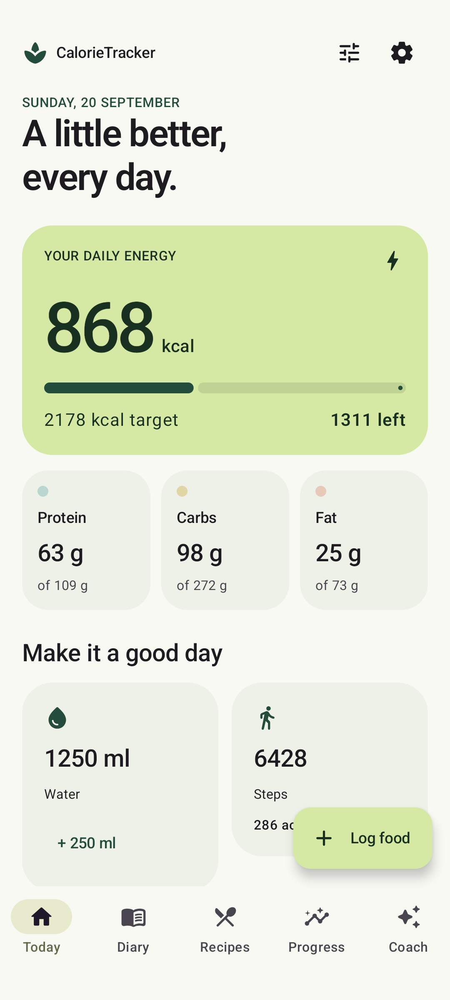
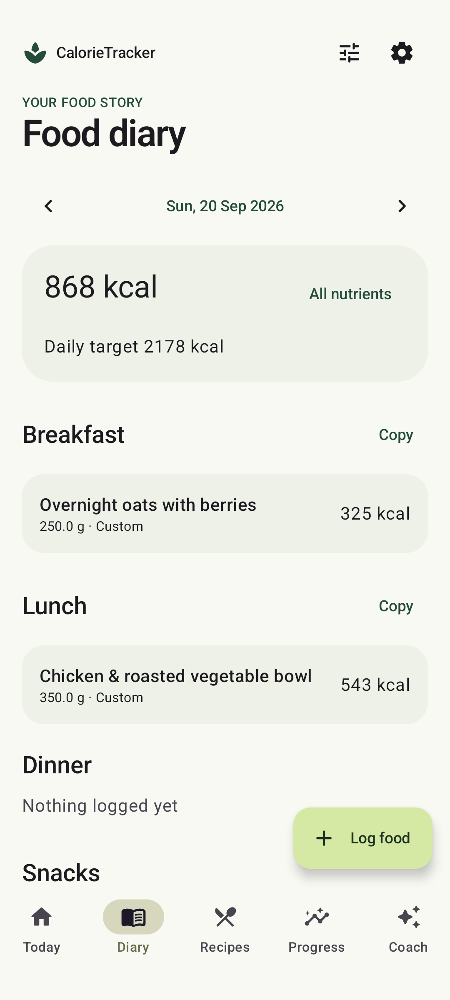
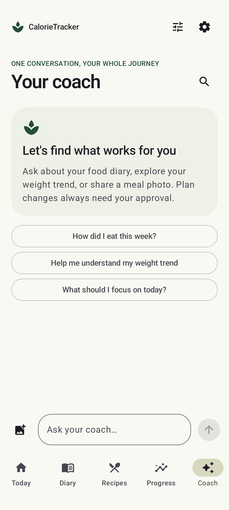

# CalorieTracker

A native Android food diary with a calm Material 3 interface, Belgian-friendly food search,
recipe portions, Health Connect activity and one persistent DeepSeek coach.

**[Download the latest signed APK](https://github.com/LainsMain/calorietracker-android/releases/latest)** · Android 10+

No account, app backend, ads or analytics. Your records stay encrypted on your device.
Online search, AI requests and update downloads use the relevant external providers.

## What you can do

- Set up your goals and review estimated calorie/macro targets; edit plans at any time.
- Search Open Food Facts, scan EAN/UPC barcodes, use recent/favourite foods, or create custom foods.
- Search **2,887 bundled CoFID foods offline**, with common Dutch and French search aliases.
- Log grams, millilitres or defined servings; keep unknown nutrients distinct from zero.
- Build recipes with a **finished batch weight** and log any gram-based portion.
- Keep historical food/recipe snapshots and effective-dated plan versions.
- Track water, weight trends, measurements and encrypted progress photographs.
- Read workouts, steps, distance, energy and weight through Health Connect.
- Chat with DeepSeek using your own API key, attach images, retrieve past records, and review
  proposed food entries, recipes or plan changes before applying them.
- Export/restore password-encrypted backups, enable app locking, use reminders and a quick-log widget.
- Download verified updates with progress, cancellation/retry and Android installation confirmation.

## First use

1. Download the APK from Releases and approve its installation in Android.
2. Complete setup and review the suggested targets, or enter your own.
3. In Settings, connect Health Connect if you use a compatible fitness app.
4. Optionally enter a DeepSeek API key. AI requests are billed to that key; selected messages,
   images and relevant diary/health context are sent to DeepSeek.
5. Export an encrypted backup before uninstalling or changing phones. There is no automatic cloud sync.

Food coverage is broad but not universal. Missing products can be added manually or from a
label photo reviewed with the coach. Search includes international products and prefers Belgian matches.

## Screenshots

The screenshots below contain **synthetic test data**, not personal records.

<p>



</p>

## Build and test

JDK 17; Android SDK 37.0; Build Tools 36.0.0. Create `local.properties` with your SDK location,
or set `ANDROID_HOME`. Open in a compatible Android Studio or run:

```sh
./gradlew :app:assembleDebug :app:testDebugUnitTest :app:lintDebug
ANDROID_SERIAL=emulator-5554 ./gradlew :app:connectedDebugAndroidTest
```

See [architecture](docs/ARCHITECTURE.md), [privacy](docs/PRIVACY.md),
[release/signing instructions](docs/RELEASING.md), [verification](docs/TESTING.md),
and [data licences](THIRD_PARTY_NOTICES.md).

## Boundaries

- General wellness tracking, not diagnosis or treatment. Automated target estimates are for
  eligible adults; clinical/pregnancy/breastfeeding profiles use manually supplied targets.
- Food photo portions are estimates and require review. Progress photos do not measure body fat.
- Health Connect access depends on device/provider support and granted permissions. Activity
  does not automatically increase food targets. The readable window is 30 days, or 90 with
  optional history access.
- The coach searches app records and food databases, not the general web. An internet connection,
  supported DeepSeek model and funded API key are required. Original timestamped chat remains
  local; context compaction does not delete it.
- APK updates require Android's system installation approval. Store distribution is outside
  this release's scope.

Application code: MIT. CoFID data: OGL v3. Open Food Facts data: ODbL; see notices.
